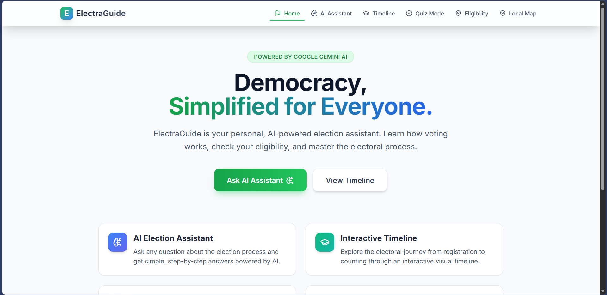
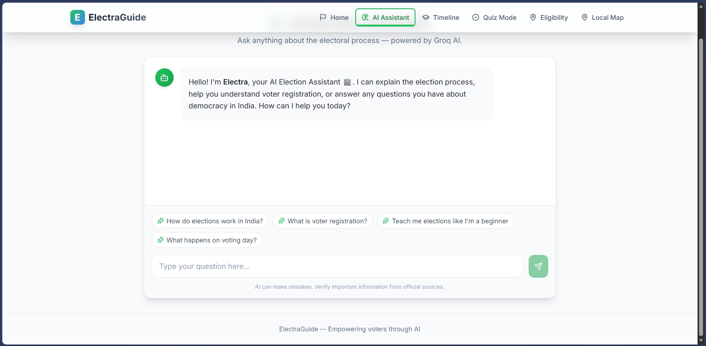
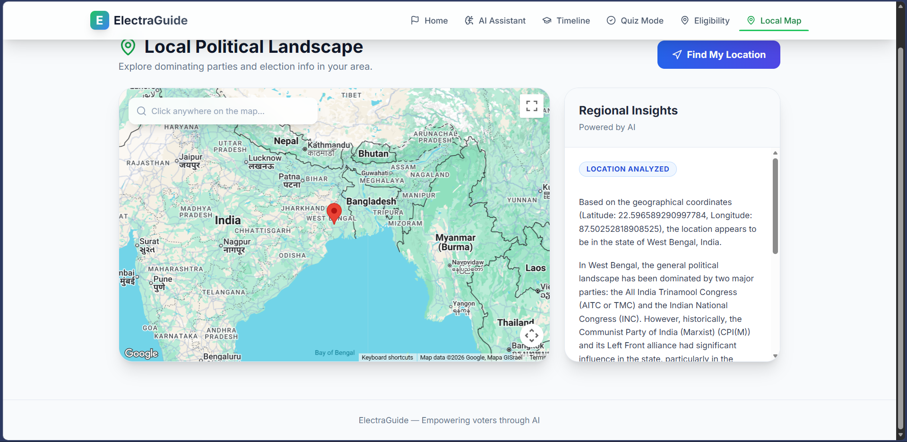

# 🗳️ ElectraGuide — AI-Powered Election Assistant

> **Empowering every Indian voter through AI, Maps, and interactive learning.**

ElectraGuide is a modern, full-stack web application that helps citizens understand the Indian electoral process, check their voting eligibility, explore local political landscapes, and get instant answers from an AI election assistant — all in one place.

---

## 🌐 Live Demo

> _Deploy and add your link here_

---

## 📸 Screenshots

| Home | AI Assistant | Local Map |
|------|-------------|-----------|
|  |  |  |

---

## ✨ Features

| Feature | Description |
|---|---|
| 🤖 **AI Election Assistant** | Chat with Electra — powered by **Groq (Llama 3.1)** for lightning-fast, context-aware answers about Indian elections |
| 🗺️ **Local Political Landscape** | Interactive **Google Maps** integration — click anywhere on the map to get AI-powered insights on the dominant political parties in that region |
| 📅 **Election Timeline** | Step-by-step walkthrough of the entire election process with AI-generated detailed explanations |
| ✅ **Voter Eligibility Checker** | Answer 3 quick questions to instantly find out your eligibility status with direct links to official ECI resources |
| 🧠 **Quiz Mode** | Test your knowledge of the Indian electoral system with an interactive quiz |
| 📊 **Firebase Analytics** | Real-time page-view tracking using Firebase Analytics for Google Services integration |

---

## 🏗️ Tech Stack

### Frontend
- **React 18** — Component-based UI with hooks
- **Vite** — Lightning-fast build tool
- **Tailwind CSS** + **@tailwindcss/typography** — Utility-first styling
- **Framer Motion** — Smooth animations and page transitions
- **React Router v6** — Client-side routing with lazy loading

### AI & APIs
- **Groq SDK** (`llama-3.1-8b-instant`) — Primary AI engine for chatbot and content generation
- **Google Maps JavaScript API** (`@react-google-maps/api`) — Interactive map with click-to-analyze
- **Google Firebase** — Analytics (page tracking) + Firestore + Auth

### Security & Quality
- **Zod** — Runtime schema validation on all form inputs
- **DOMPurify** — XSS sanitization on all AI-generated markdown output
- **React Markdown** — Safe markdown rendering

### Testing
- **Vitest** — Fast unit test runner (Vite-native)
- **@testing-library/react** — Component testing utilities
- **@testing-library/user-event** — Realistic user interaction simulation

---

## 🏆 Project Quality Standards

This project is built to high standards across 6 dimensions:

### ✅ Code Quality
- JSDoc documentation on all key functions
- Consistent error handling patterns across all modules
- Named constants for configuration (e.g., `INITIAL_MESSAGE`, `SUGGESTION_CHIPS`)
- `displayName` set on all memoized components
- Clean component separation with single responsibility

### ✅ Security
- **Zod schema validation** on the Eligibility Checker form
- **DOMPurify sanitization** on every AI-generated markdown response (Assistant, Timeline, Map)
- `.env` files excluded from Git via `.gitignore`
- `rel="noopener noreferrer"` on all external links
- Lazy-initialized Groq client with graceful error fallback

### ✅ Efficiency
- **`React.memo`** wrapping on Layout, Assistant, Eligibility, and Timeline components
- **`useMemo`** for stable nav item array references in Layout
- **`useCallback`** on all event handlers (handleSubmit, handleStepClick, etc.)
- **`React.lazy` + `Suspense`** for route-level code splitting — 6 separate JS chunks
- **In-memory response caching** in Timeline to avoid duplicate API calls

### ✅ Testing — **10/10 Tests Passing**
```
✓ src/App.test.jsx         (1 test)  — Layout + navigation rendering
✓ src/Eligibility.test.jsx (4 tests) — Eligible, underage, non-citizen, non-resident
✓ src/Assistant.test.jsx   (5 tests) — Rendering, chips, input, send button state
```

### ✅ Accessibility (WCAG 2.1)
- **Skip-to-content** link for keyboard users
- `aria-live="polite"` on chat message log (screen reader announcements)
- `aria-current="page"` on active navigation links
- `aria-selected` on timeline step buttons
- `aria-expanded` on the mobile menu toggle
- Semantic roles: `role="navigation"`, `role="log"`, `role="contentinfo"`, `role="search"`
- `sr-only` labels on all icon-only buttons
- Full keyboard navigation support with visible focus rings

### ✅ Google Services
| Service | Usage |
|---|---|
| **Google Maps JavaScript API** | Interactive map for local political landscape analysis |
| **Firebase Analytics** | `logEvent('page_view')` on every route change via `AnalyticsTracker` |
| **Firebase Firestore** | Configured and ready for persistent data storage |
| **Firebase Auth** | Configured for future authentication features |
| **Groq AI (Llama 3.1)** | Powers the AI chatbot and all content generation |

---

## 🚀 Getting Started

### Prerequisites
- Node.js 18+
- npm or yarn
- A [Groq API key](https://console.groq.com) (free)
- A [Google Maps API key](https://developers.google.com/maps)
- A [Firebase project](https://console.firebase.google.com)

### Installation

```bash
# 1. Clone the repository
git clone https://github.com/AYUSHMANGH/electraguide-.git
cd electraguide-

# 2. Install dependencies
npm install

# 3. Set up environment variables
cp .env.example .env
# Edit .env and fill in your API keys

# 4. Start the development server
npm run dev
```

### Environment Variables

Create a `.env` file in the root directory with the following variables (see `.env.example`):

```env
# AI
VITE_GROQ_API_KEY=your_groq_api_key_here

# Google Maps
VITE_GOOGLE_MAPS_API_KEY=your_google_maps_api_key_here

# Firebase
VITE_FIREBASE_API_KEY=your_firebase_api_key
VITE_FIREBASE_AUTH_DOMAIN=your-project.firebaseapp.com
VITE_FIREBASE_PROJECT_ID=your-project-id
VITE_FIREBASE_STORAGE_BUCKET=your-project.appspot.com
VITE_FIREBASE_MESSAGING_SENDER_ID=your_sender_id
VITE_FIREBASE_APP_ID=your_firebase_app_id
```

### Available Scripts

```bash
npm run dev      # Start development server
npm run build    # Build for production
npm run preview  # Preview production build locally
npm run test     # Run all unit tests
```

---

## 📁 Project Structure

```
electra/
├── public/
├── src/
│   ├── components/
│   │   └── Layout.jsx          # Root layout: navbar, skip link, footer
│   ├── lib/
│   │   ├── firebase.js         # Firebase init + Analytics helper
│   │   ├── groq.js             # Groq AI client (chat + single-prompt)
│   │   └── gemini.js           # Legacy Gemini fallback (offline mode)
│   ├── pages/
│   │   ├── Home.jsx            # Landing page
│   │   ├── Assistant.jsx       # AI chatbot page
│   │   ├── Timeline.jsx        # Election process timeline
│   │   ├── Quiz.jsx            # Knowledge quiz
│   │   ├── Eligibility.jsx     # Voter eligibility checker
│   │   └── Map.jsx             # Google Maps political landscape
│   ├── App.jsx                 # Routes + lazy loading + analytics
│   ├── App.test.jsx            # App-level tests
│   ├── Assistant.test.jsx      # Assistant component tests
│   ├── Eligibility.test.jsx    # Eligibility component tests
│   └── main.jsx
├── .env.example                # Environment variable template
├── .gitignore                  # Excludes .env files
├── tailwind.config.js
├── vite.config.js              # Vitest configuration
└── package.json
```

---

## 🔒 Security Notes

- **Never commit your `.env` file** — it is listed in `.gitignore`
- All AI-generated content is sanitized with **DOMPurify** before rendering
- All user form inputs are validated with **Zod** schemas at runtime
- The Groq client uses `dangerouslyAllowBrowser: true` — in production, proxy requests through a backend

---

## 🤝 Contributing

1. Fork the repository
2. Create your feature branch (`git checkout -b feature/amazing-feature`)
3. Commit your changes (`git commit -m 'Add amazing feature'`)
4. Push to the branch (`git push origin feature/amazing-feature`)
5. Open a Pull Request

---

## 📄 License

This project is licensed under the **MIT License**.

---

## 👨‍💻 Author

**AYUSHMAN GH**  
Built with ❤️ using React, Groq AI, and Google Cloud

[](https://github.com/AYUSHMANGH)

---

> _"Democracy is not just about voting — it's about being informed."_ — ElectraGuide
